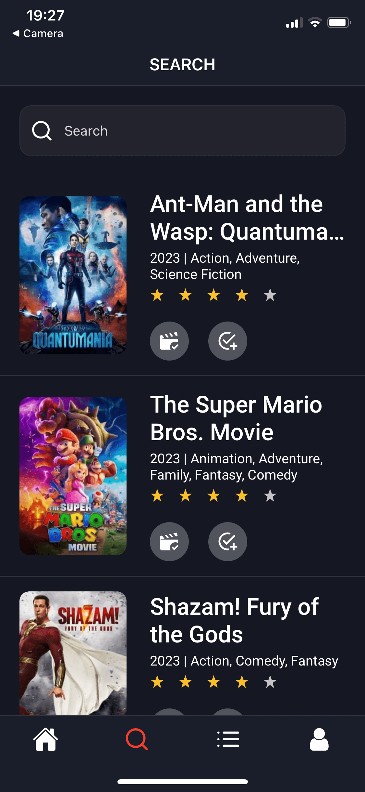
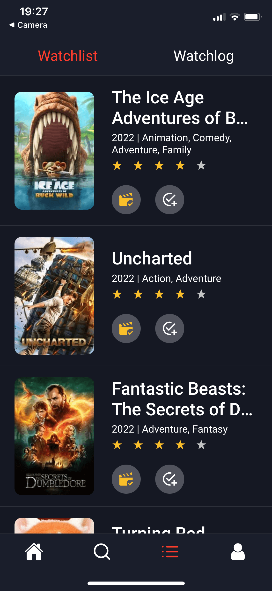

# movielog-mobile-app

A mobile app that allows users to discover, and add movies
to their watchlist   

   

## Technologies Used

### Frontend

- React Native 
- Expo
- Formik
- React Query
- Axios
- Moment

### Backend

- NodeJS
- ExpressJS
- MongoDB
- Mongoose
- Yup
- Bcrypt
- Crypto
- Json Web Token
- Needle
- Nodemailer
